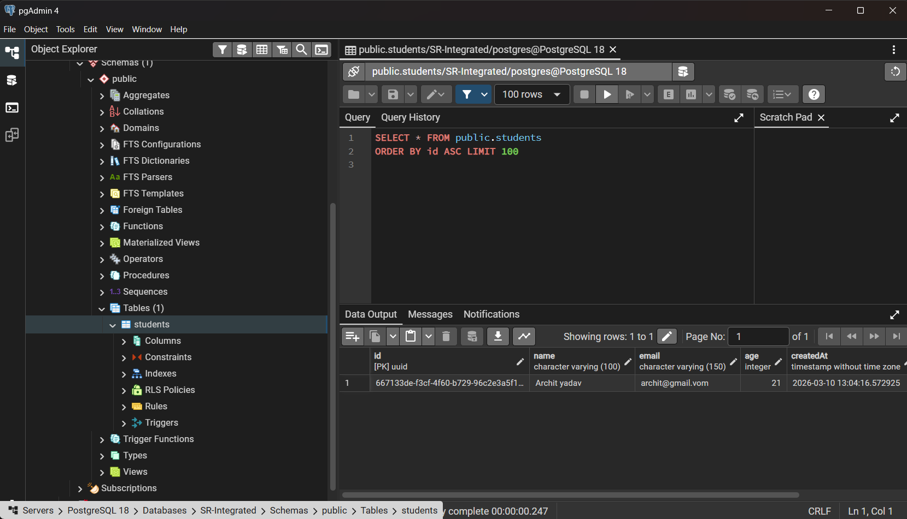

# 🎓 Student Records Management System — Backend


REST API backend for the Student Records Management System.
*Developed by **Archit Yadav** for S R Integrated Circuit India*

## 📸 Database Preview


REST API backend for the Student Records Management System.
*Developed by **Archit Yadav** for S R Integrated Circuit India*

---

## 📡 API Endpoints

| Method | Endpoint | Description |
|---|---|---|
| `GET` | `/api/students` | Get all students |
| `GET` | `/api/students/:id` | Get one student |
| `POST` | `/api/students` | Create a student |
| `PUT` | `/api/students/:id` | Update a student |
| `DELETE` | `/api/students/:id` | Delete a student |

---

## 🚀 Getting Started

### 1. Prerequisites
- Node.js >= 18
- PostgreSQL running locally

### 2. Create the database
```sql
-- In psql or pgAdmin
CREATE DATABASE students_db;
```

### 3. Configure environment
```bash
cp .env.example .env
# Edit .env with your DB credentials
```

```env
DB_HOST=localhost
DB_PORT=5432
DB_USER=postgres
DB_PASSWORD=yourpassword
DB_NAME=students_db
PORT=3001
```

### 4. Install & run
```bash
npm install
npm run start:dev
# → http://localhost:3001/api
```

> TypeORM `synchronize: true` auto-creates the `students` table on first run.

---

## 🏗️ Project Structure

```
src/
├── students/
│   ├── dto/
│   │   ├── create-student.dto.ts
│   │   └── update-student.dto.ts
│   ├── student.entity.ts
│   ├── students.controller.ts
│   ├── students.module.ts
│   └── students.service.ts
├── app.module.ts
└── main.ts
```

---

## 🌐 Deployment (Render)

1. Push this repo to GitHub
2. Create a new **Web Service** on [render.com](https://render.com)
3. Set build command: `npm install && npm run build`
4. Set start command: `npm run start:prod`
5. Add environment variables in the Render dashboard
6. Use a [Supabase](https://supabase.com) PostgreSQL URL for `DB_*` variables

---

## 👨‍💻 Author

**Archit Yadav** — S R Integrated Circuit India
